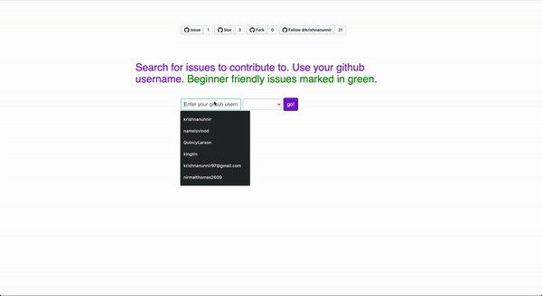

# Opensource Contrib First Search
[](https://github.com/krishnanunnir/server_monitor_bot/blob/master/LICENSE)
[](https://github.com/ellerbrock/open-source-badges/)

<p align="center">
  
</p>

When I first tried contributing to open source it was very difficult finding relevant issues that I would actually enjoy contributing to, In the spirit of open-source, I thought I should make this process a bit simpler for other people who are on the same boat. So I made a website to do this.

Also a commandline tool for this will be coming soon!!

## Running your local build

Add environment variables in .env file for
1. TOKEN - which should be set to the personal access token from github
2. PORT - which should be the port where you want to set your server.

## Installing dependancies

```npm install```

## Todo

- [x] Repo name is not being displayed(high-priority).  
- [x] Add star repo button in the site.  
- [x] Add labels to show beginner friendly issues
- [ ] Implement command line tool for the product.

