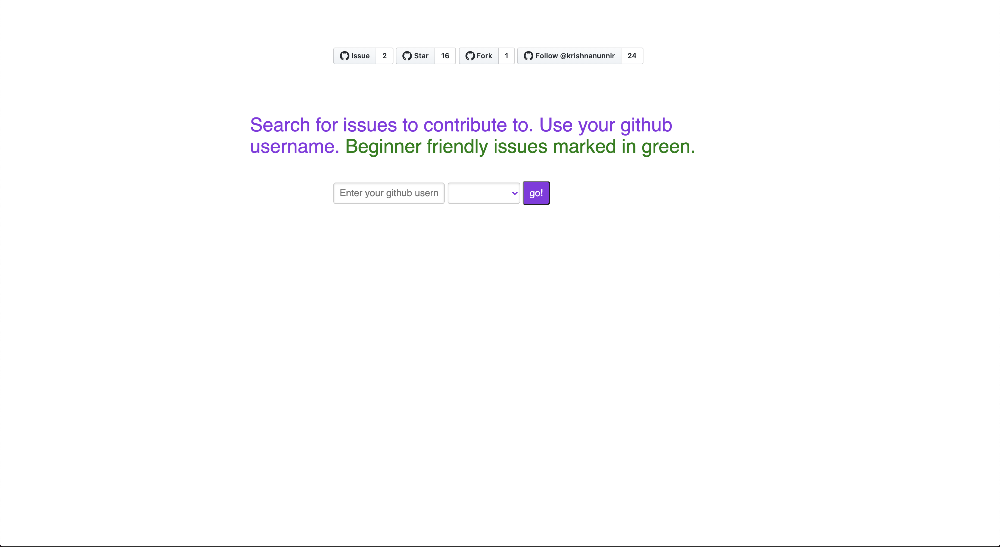

## A walkthrough buidling First Contrib

[website](https://firstcontrib.herokuapp.com/) [repo](https://github.com/krishnanunnir/opensource-first-contrib-search)  

Contributing to open source is an intimidating task. It includes learning the language of implementation, familiarising with the codebase and setting up a build on a machine. For a newcomer, this is a tough task, pushed further away from his grasp by unfamiliarity with using Github. Github UI is notoriously bad in its intuitiveness.

Now coming to how I go about searching for open source issues. The process for me involves finding a repo, searching for a beginner-friendly issue to acclimate myself with the codebase, finding the issue already assigned to somebody else and crying in desperation. This ultimately becomes a very frustrating and fruitless exercise. I found this sentiment echoed in Reddit and twitter. With this in mind, I decided to find a way to simplify this process. 

First Contrib was my solution. A way to search for issues relevant to you that has not been assigned to anyone and free for taking, also with the option to distinguish beginner-friendly issues.  

<iframe src="https://www.youtube.com/embed/fiS4sBCAyfg" frameborder="0" allow="accelerometer; autoplay; encrypted-media; gyroscope; picture-in-picture" allowfullscreen></iframe>

The first problem was linking a user to the repos he would like contributing to. I made an assumption here - a user who wants to contribute to a repo would star that repo. Now I looked at the issues in these repos, that are open and unassigned. The next question would be how to identify beginner-friendly issues. I searched for issues with labels like the "beginner friendly", "good first issue" if an issue has one of these labels, the status of the issue is set as beginner-friendly and this could be somehow shown in the UI.

Coming to the implementation, I was doing a course on Nodejs, so I thought of this has a learning experience and went with javascript. This is a project working with APIs, there is no need for a backend but I decided to go with Express since I had plans to convert this into an npm package(Issue up for grabs!), Express because I had a basic knowledge about it.   

For the templating engine, I thought about going with Pug as I saw it being preferred for use in a lot of places, but I had no clue about Pug and wanted to get started with the project as soon as possible, so I went with EJS, which is a templating engine that closely resembles vanilla Html and the Django default templating system I am already familiar with. 

Now that I had decided on the implementation, it was time to work with the Github API, Github has two versions of API - API V3, which is REST and API V4, which is GraphQL. Owing to my familiarity with REST, I went with it, this would prove to be costly later. As it was my first time with javascript, it took me a bit of time to figure out asynchronous programming.  

After figuring out the idea of asynchronous programming, I implemented the basic search to find issues for all of the starred repos. I started with the rest of the implementation and I found it to be getting way too complicated. I was making a request to get the starred repos, then requests for getting issue of each repo and I had to clean this data before I could return it. This was becoming a bit tedious.

My friend was working on another project with Github GraphQL API, he suggested to go with Graphql, initially, I found it a bit intimidating largely due to the documentation lacking solid examples. After tinkering with Graphql for some time, I realised I need to switch as the advantages offered by GraphQl over REST were way too high, for one, I only need to make one request for all of this data and the data returned is based on the query we formulated, so we needn't worry about cleaning it.

For a user with 250 repos with 2 issues each that would satisfy the search condition, with REST API a total of 501 requests would be made, it would take further processing to clean these issues. All of these steps becoem greatly simplified on using GraphQL API and would take just one query.

After spending a considerable amount of time figuring out GraphQL, I rewrote everything from REST to GraphQL and it wasn't as tough as I thought it would be, it was very easy once I got the hang of it. I needed to slightly clean the data since GraphQL doesn't provide a filter for when an issue is created, instead, they provide a filter for the time the issue was last updated('since') I used this as a primary filter and wrote a filter based on the CreatedAt time.

The website is nearly completed at this point, the routing and server are handled by Express, NodeJs code. For the beginner-friendly issues, I cross-checked the returned labels with the list of beginner-friendly labels I have defined and set the 'beginnerfriendly' status of the issue of any of the labels of the matches. Based on this status I changed the UI element so that the beginner-friendly issues stood out from the other issues.

The last challenge was having the time check, that is to return issues from the past week, month or year. This was pretty simple, they had provided a date-time filter('since') as described earlier, the only challenging part was converting to ISO 8601 format, which turned out to be a matter of a function call(toISOString). 

And so first contrib was born.

